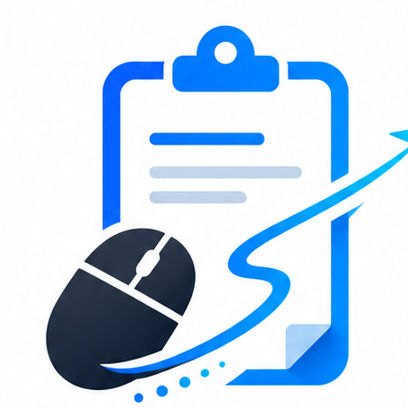
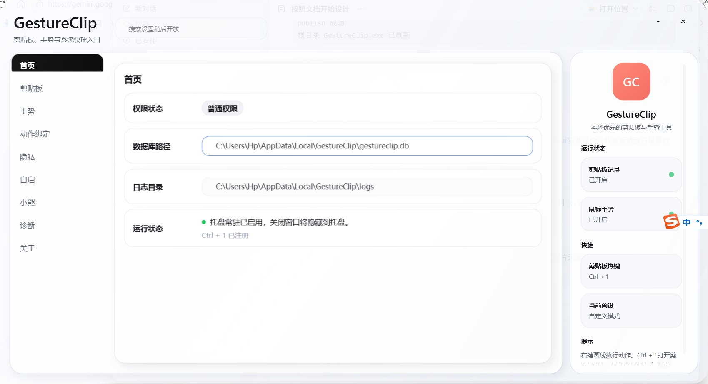
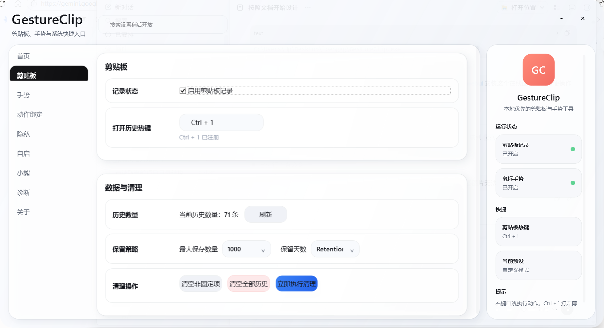
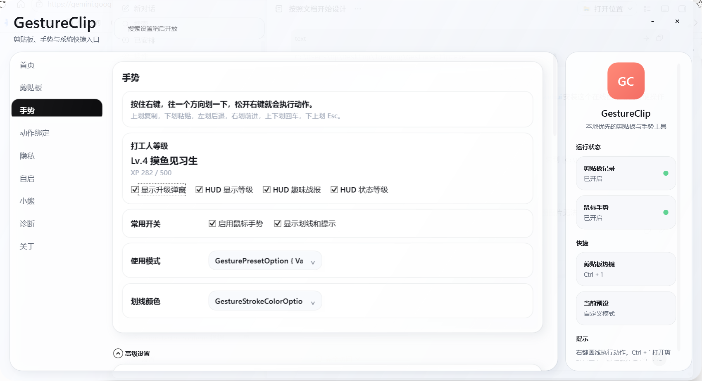
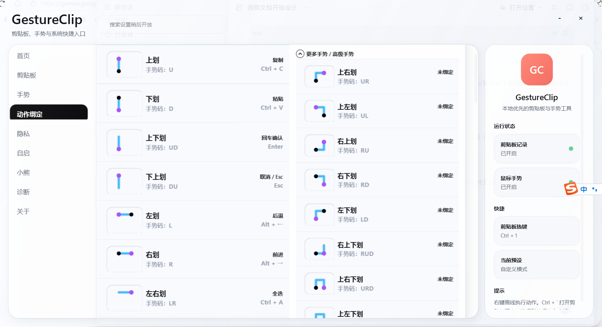
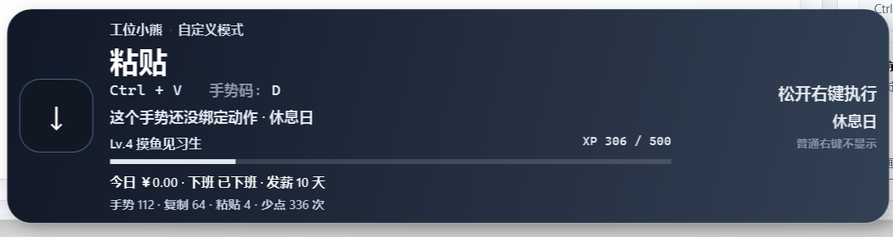
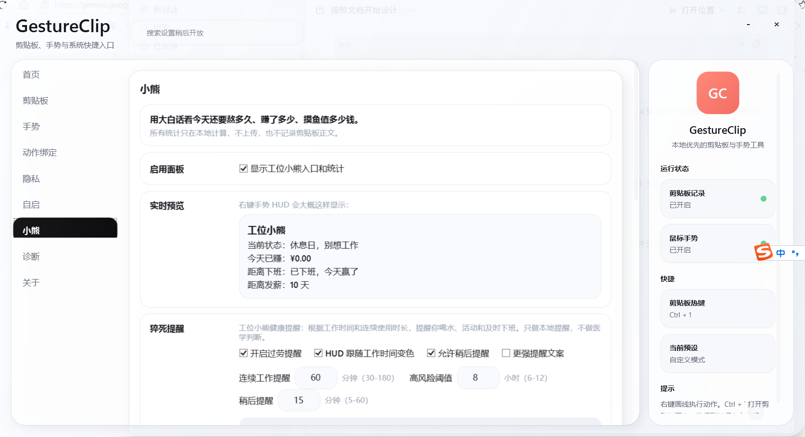

# GestureClip

<p align="center">
  
</p>

<p align="center">
  <strong>Windows 本地优先</strong>的剪贴板历史 + 鼠标手势 + 本地文本助手
</p>

<p align="center">
  <a href="https://github.com/hhuhuwang-gif/GestureClip.App/releases/latest"></a>
  <a href="https://github.com/hhuhuwang-gif/GestureClip.App/releases/latest"></a>
  
  
</p>

<p align="center">
  复制过的文字 / 图片能找回来 · 右键一划完成常用操作 · 本地文本处理<br />
  <strong>不登录 · 不上传 · 不云同步</strong>
</p>

<p align="center">
  <a href="https://github.com/hhuhuwang-gif/GestureClip.App/releases/latest"><strong>⬇ 下载最新版（Latest）</strong></a>
  ·
  <a href="https://github.com/hhuhuwang-gif/GestureClip.App/releases/download/v0.6.25-beta/GestureClip-v0.6.25-beta-win-x64.zip"><strong>v0.6.25 Beta zip</strong></a>
  ·
  <a href="https://github.com/hhuhuwang-gif/GestureClip.App/releases/tag/v0.6.25-beta">Release 说明</a>
  ·
  <a href="CHANGELOG.md">更新日志</a>
</p>



---

## 目录

- [30 秒上手](#30-秒上手)
- [当前版本](#当前版本v0624-beta)
- [核心功能](#核心功能)
- [数据与隐私](#数据与隐私)
- [安装与更新](#安装与更新)
- [常见问题](#常见问题)
- [开发与发布](#开发与发布)
- [截图](#截图)

---

## 30 秒上手

| 你想做的事 | 怎么做 |
| --- | --- |
| 打开剪贴板历史 | `Ctrl + \`` |
| 找回刚复制过的文字 / 图片 | 历史里搜索 → 双击复制，或 Enter 粘贴 |
| 右键手势 | **按住右键**上划复制、下划粘贴、左划后退、右划前进 |
| 本地文本处理 | `Ctrl + Shift + Q` 打开快捷动作 |
| 工位小熊（可选） | 托盘 → 工位小熊 → 填月薪与上下班时间 |

推荐下载 **Setup zip**，解压后双击 `Setup.cmd` 安装到当前用户目录；也可解压便携 zip 后直接双击 `GestureClip.exe`（Windows x64 self-contained，一般**无需**安装 .NET）。

---

## 当前版本：v0.6.25 Beta

| 资源 | 链接 |
| --- | --- |
| **推荐下载（Latest）** | [Releases / latest](https://github.com/hhuhuwang-gif/GestureClip.App/releases/latest) |
| 安装包 | [GestureClip-v0.6.25-beta-win-x64.zip](https://github.com/hhuhuwang-gif/GestureClip.App/releases/download/v0.6.25-beta/GestureClip-v0.6.25-beta-win-x64.zip) |
| 校验文件 | [SHA256SUMS.txt](https://github.com/hhuhuwang-gif/GestureClip.App/releases/download/v0.6.25-beta/SHA256SUMS.txt) |
| 历史版本 | 旧版在 Releases 里标记为 **Pre-release**，默认请用 Latest |

### 本版亮点（v0.6.25）

- **设置 UI 重设计**：三栏布局、分组导航、可折叠状态栏、全宽设置内容
- **玻璃浅色主题**：snow/cloud/slate/sky-blue，减少框套框与视觉噪声
- **可用设置搜索**：搜索并滚动到具体分组（智能粘贴、快捷键、左键增强等）
- **手势/动作绑定页扁平化**：分区标题 + 列表容器，下拉选择更可靠
- **窗口可缩放 + 细滚动条贴边**：无边框窗口拖边调整，滚动更舒适
- **隐私**：便携 zip 仍写数据到 `%LOCALAPPDATA%\GestureClip`

---

## 适合谁？

- 每天大量复制粘贴的办公、客服、运营、开发、写作用户
- 想用鼠标手势提速，但不想装臃肿软件
- 需要**本机**剪贴板历史，拒绝内容上云
- 想要轻量、可关闭的打工状态反馈（工位小熊）

---

## 核心功能

### 1. 剪贴板历史

- 文本 + 图片 / 截图，支持搜索、固定、收藏、多选合并复制
- 左侧色条：蓝=文本 · 紫=图片 · 橙=置顶 · **绿=本会话已复制**
- 可暂停记录；数据在本机 SQLite



### 2. 快捷键

| 默认快捷键 | 作用 |
| --- | --- |
| `Ctrl + \`` | 打开 / 关闭剪贴板历史 |
| `Ctrl + Shift + Q` | 快捷动作面板（本地文本助手） |
| `Ctrl + Shift + V` | 纯文本粘贴（可在设置中改） |

均可在设置中修改。

### 3. 快捷动作（本地助手）

对当前剪贴板文本做**纯本地**处理：去空格、大小写、JSON 美化/压缩、URL 编解码、HTML→纯文本、链接去追踪参数等。  
结果可预览、写回剪贴板或直接粘贴。**不登录、不上传。**

### 4. 鼠标右键手势

按住右键划出轨迹，松开执行。

| 手势 | 默认动作 |
| --- | --- |
| 上划 | 复制 `Ctrl+C` |
| 下划 | 粘贴 `Ctrl+V`（智能粘贴按应用策略净化） |
| 上下 / 下上 | 回车 / Esc |
| 左 / 右 | 后退 / 前进 |
| 左右 / 右左 | 全选 / 撤销 |
| 下左 | 粘贴并回车 |

可在设置中自定义绑定；支持左键增强等高级手势。





### 5. 手势 HUD + 工位小熊（可选）

划手势时显示当前动作；可打开工位小熊看今日收益估算、下班倒计时、复制/粘贴统计与等级。**可关闭。**





---

## 数据与隐私

| 原则 | 说明 |
| --- | --- |
| 本地优先 | 不需要账号，不云同步 |
| 不上云 | 不上传剪贴板正文、图片、工资与统计 |
| 最小权限 | 不读浏览器正文、密码、Token、Cookie |
| 可关可清 | 可暂停剪贴板 / 手势；可清空历史；可设应用黑名单 |
| 安全导出 | 诊断包不含数据库与图片原图；日志不含剪贴板正文 |

```text
数据：%LOCALAPPDATA%\GestureClip\gestureclip.db
日志：%LOCALAPPDATA%\GestureClip\logs\
```

**覆盖更新程序不会删除**历史与设置。更多：[PRIVACY.md](PRIVACY.md) · [KNOWN_ISSUES.md](KNOWN_ISSUES.md) · [ROADMAP.md](ROADMAP.md)

---

## 安装与更新

1. 打开 [最新 Release（Latest）](https://github.com/hhuhuwang-gif/GestureClip.App/releases/latest)
2. 下载 `GestureClip-v*-win-x64.zip`（可对照 `SHA256SUMS.txt`）
3. 若已在运行：先退出，任务管理器确认无 `GestureClip.exe`
4. 解压覆盖旧目录（或新目录首次使用）
5. 双击 `GestureClip.exe`

应用内：**设置 / 托盘 → 检查更新** 也可下载新版。  
用户数据始终在 `%LOCALAPPDATA%\GestureClip\`。详见 [UPDATE.md](UPDATE.md)。

> 当前 Beta **未代码签名**，SmartScreen 可能提示「未知发布者」，属预期现象。  
> Releases 列表里旧版本标为 **Pre-release**，请优先下载带 **Latest** 的版本。

---

## 常见问题

**管理员窗口里手势 / 粘贴不生效？**  
普通权限进程通常无法控制管理员窗口。需要时请以管理员身份运行 GestureClip。

**图片搜不到？**  
清空搜索框，或切到「图片」筛选。

**从历史复制网页 / ChatGPT 内容再贴不完整？**  
v0.6.25 起历史再复制会统一写成纯文本；也可用「复制为纯文本」或 `Ctrl+Shift+C`。

**剪贴板图片粘到别的软件无效？**  
复制图片时会同时写入 Bitmap / PNG / DIB。

**检查更新失败？**  
可手动到 [Latest](https://github.com/hhuhuwang-gif/GestureClip.App/releases/latest) 下载。

**为什么 GitHub 上还有很多旧版本？**  
历史包仍保留下载；已标为 Pre-release。日常请只用 **Latest = v0.6.25 Beta**。

---

## 开发与发布

```powershell
dotnet build .\GestureClip.sln -c Release
dotnet test .\GestureClip.sln
powershell -ExecutionPolicy Bypass -File .\scripts\publish-win-x64.ps1
```

产物在 `artifacts\release\`。

---

## 分享文案（可复制）

```text
我做了一个 Windows 本地剪贴板历史 + 鼠标手势工具：GestureClip

- 剪贴板历史：文字/图片可找回，本机 SQLite，不上传
- 右键手势：一划复制、粘贴、前进后退等
- 本地快捷动作：Ctrl+Shift+Q 做去空格、JSON、URL 等
- 工位小熊（可选）：下班倒计时、复制统计

v0.6.25 Beta，解压双击 GestureClip.exe。

项目：https://github.com/hhuhuwang-gif/GestureClip.App
下载：https://github.com/hhuhuwang-gif/GestureClip.App/releases/latest
```

---

## 截图

| 首页 | 剪贴板 |
| --- | --- |
|  |  |

| 手势 | 动作绑定 |
| --- | --- |
|  |  |

| HUD | 工位小熊 |
| --- | --- |
|  |  |

---

<p align="center">
  Made for Windows · Local first · <a href="https://github.com/hhuhuwang-gif/GestureClip.App/issues">反馈 Issue</a>
</p>
