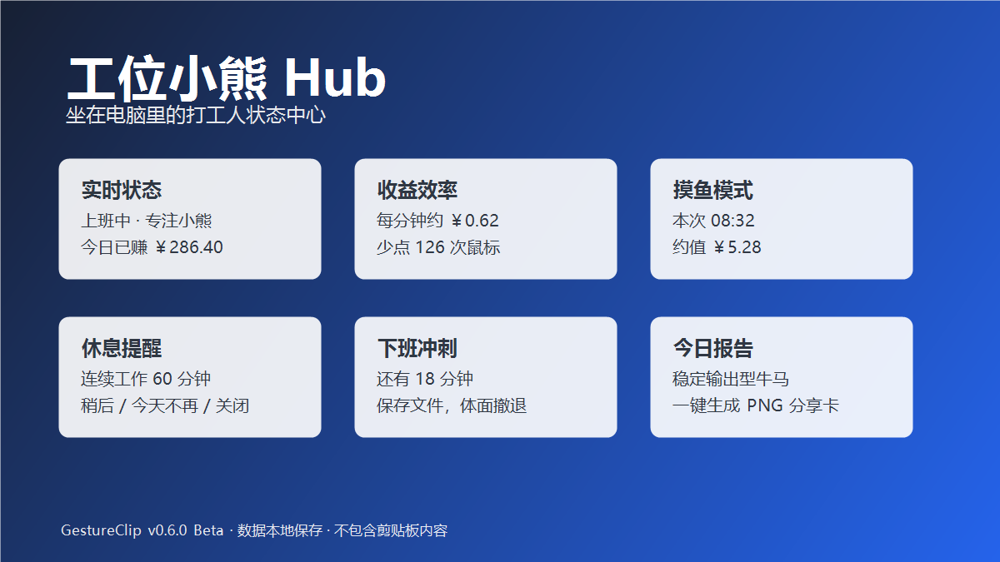

# GestureClip 30 秒上手演示

> 本地优先：剪贴板历史 + 鼠标手势 + 可选工位小熊。不登录、不上传。

## 1. 安装（约 10 秒）

1. 打开 [Latest Release](https://github.com/hhuhuwang-gif/GestureClip.App/releases/latest)  
2. 推荐：下载 **Setup zip** → 解压 → 双击 `Setup.cmd`  
3. 或：下载便携 zip → 解压 → 双击 `GestureClip.exe`

数据在 `%LOCALAPPDATA%\GestureClip\`，覆盖更新不丢。

## 2. 剪贴板历史（约 10 秒）

1. 按 `Ctrl + \`` 打开历史  
2. 搜索刚才复制的内容  
3. 双击复制，或 Enter 粘贴  

## 3. 鼠标手势（约 10 秒）

1. **按住右键** 上划 = 复制，下划 = 粘贴（默认预设）  
2. 打开设置 → 动作绑定，可改每个手势的动作  
3. 试试「插入今天日期 / 话术 1」绑到某个手势  

## 4. 可选：工位小熊

托盘 → 工位小熊：填月薪与上下班时间，看「还要熬多久」。

## 关键截图

| 画面 | 文件 |
| --- | --- |
| 设置首页 | [settings-home.png](images/settings-home.png) |
| 剪贴板设置 | [settings-clipboard.png](images/settings-clipboard.png) |
| 手势设置 | [settings-gestures.png](images/settings-gestures.png) |
| 动作绑定 | [gesture-bindings.png](images/gesture-bindings.png) |
| HUD / 小熊 | [gesture-hud-workbear.png](images/gesture-hud-workbear.png) |

## 录制真实 GIF（可选）

本仓库当前用**静态截图导览**代替 GIF。若要自己录 30 秒 GIF：

1. 用 [ScreenToGif](https://www.screentogif.com/) 或 Win+G  
2. 按上面 1→2→3 操作一遍  
3. 导出 `docs/images/demo-30s.gif`  
4. 在 README「30 秒上手」处改为引用该 GIF  

## 隐私

默认会为常见密码管理器 / 远程桌面加入屏蔽名单。  
可在 **设置 → 隐私** 里按进程勾选「不记剪贴板 / 禁用手势」，并为指定进程覆盖**智能粘贴策略**。
